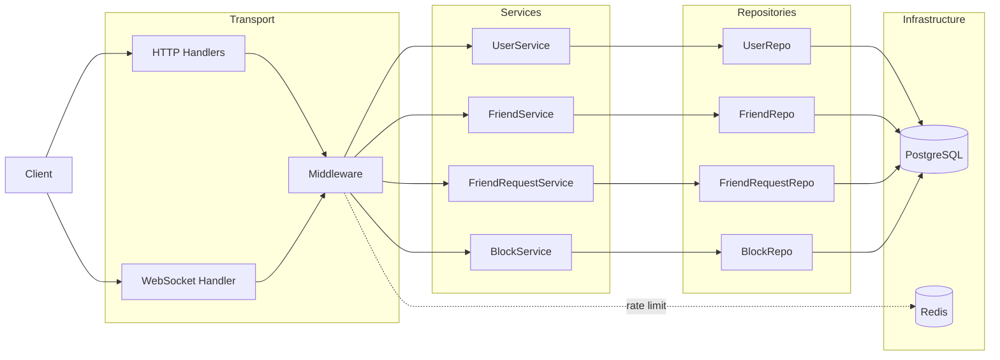
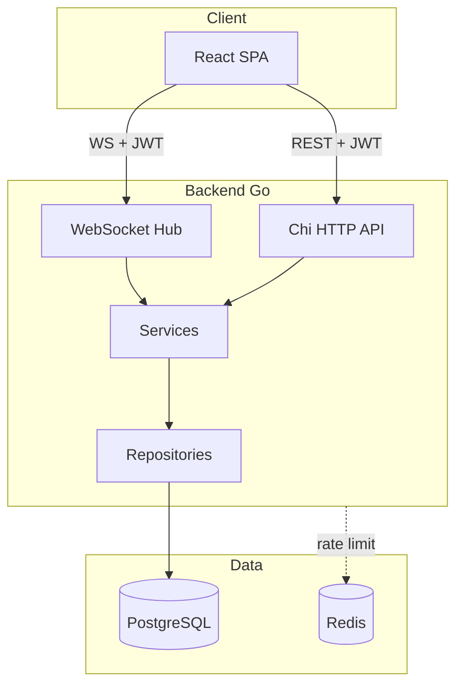

# go-chat-system — Architecture Summary

## High-level layout

The repo is a **monorepo** with two main applications:

| Layer        | Stack                                   | Location                           |
| ------------ | --------------------------------------- | ---------------------------------- |
| **Backend**  | Go (Chi), PostgreSQL, Redis, WebSockets | [backend-go/](backend-go/)         |
| **Frontend** | React, Vite, React Router               | [frontend-react/](frontend-react/) |

There is no shared package; the frontend talks to the backend over HTTP and WebSockets (API base: `http://localhost:8002/api/v1` in [frontend-react/src/api/api.js](frontend-react/src/api/api.js)).

---

## Backend architecture

The backend follows **clean, layered flow**: **Transport → Service → Repository → Database**. Dependencies are wired in one place via a manual **DI container** ([backend-go/transport/injector/injector.go](backend-go/transport/injector/injector.go)).

### Entry and bootstrap

- **Entrypoint:** [backend-go/cmd/server/main.go](backend-go/cmd/server/main.go) — initializes logger, loads config, connects to PostgreSQL and Redis, builds router, starts HTTP server and graceful shutdown.
- **Config:** Single source in [backend-go/config/config.yaml](backend-go/config/config.yaml), loaded via Viper in [backend-go/config/config.go](backend-go/config/config.go) (server, DB, Redis, JWT, CORS).

### Transport layer

- **Router:** [backend-go/transport/routes/routes.go](backend-go/transport/routes/routes.go) — Chi router with:
  - **Public:** `POST /api/v1/auth/register`, `POST /api/v1/auth/login` (rate-limited by IP).
  - **Protected (JWT):** users, friends, friend-requests, blocks, and `GET /api/v1/ws` for WebSocket (each protected group rate-limited by user).
  - **Health:** `/redis-health`, `/db-health`.
- **Middleware:** CORS, logger, JWT auth ([backend-go/transport/middleware/authmiddleware.go](backend-go/transport/middleware/authmiddleware.go)), Redis-based rate limit, recovery, response writer.
- **HTTP handlers:** Services are exposed via [backend-go/transport/wrapper/wrapper.go](backend-go/transport/wrapper/wrapper.go) — each handler returns `(statusCode, *APIResponse, error)`; wrapper writes JSON and error responses.
- **WebSocket:** [backend-go/transport/wrapper/ws_handler.go](backend-go/transport/wrapper/ws_handler.go) upgrades requests and injects JWT user ID; [backend-go/transport/websocket/hub.go](backend-go/transport/websocket/hub.go) runs a single goroutine that registers/unregisters clients and routes messages by `ReceiverUser` / `ReceiverGroup`; [client.go](backend-go/transport/websocket/client.go) and [room.go](backend-go/transport/websocket/room.go) handle per-connection and room logic; [ws_message.go](backend-go/transport/websocket/ws_message.go) defines message types.

### Domain and data

- **Models:** [backend-go/model/](backend-go/model/) — User, Message, Friend, FriendRequest (and blocks); shared fields in common types as needed.
- **Repositories:** [backend-go/repository/](backend-go/repository/) — `UserRepository`, `FriendRepository`, `FriendRequestRepository`, `BlockRepository` (all take `*sql.DB` and implement DB access).
- **Services:** [backend-go/service/](backend-go/service/) — `UserService` (register, login, search), `FriendService`, `FriendRequestService`, `BlockService`; they use repos and return data in the shape expected by the HTTP wrapper.
- **Migrations:** Goose in [backend-go/migrations/](backend-go/migrations/) — versioned SQL (users, friends, blocks, friend_requests). Applied via Makefile.

### Shared packages

- **pkg/** — JWT ([backend-go/pkg/jwt/jwt.go](backend-go/pkg/jwt/jwt.go)), logger, errors, utils (password, response, validation, db_utils).

---

## Frontend architecture

- **Stack:** React 18, Vite, React Router, Axios.
- **Entry:** [frontend-react/src/main.jsx](frontend-react/src/main.jsx) mounts `App`; [frontend-react/src/App.jsx](frontend-react/src/App.jsx) wraps the app in `BrowserRouter` and `AuthProvider`, and defines routes:
  - **Public:** `/` → `AuthPage`.
  - **Protected:** `/home` → `Home` (guarded by `ProtectedRoute` that uses `useAuth()` and redirects to `/` if not logged in).  
    **Note:** `ProtectedRoute` uses `Navigate` but it is not imported in `App.jsx` — add `import { ..., Navigate } from "react-router-dom"` to fix.
- **Auth:** [frontend-react/src/context/AuthContext.jsx](frontend-react/src/context/AuthContext.jsx) holds `user`, `loading`, `login`, `register`, `logout`; user is persisted in `localStorage` and read on load. [frontend-react/src/context/context.js](frontend-react/src/context/context.js) exports `AuthContext` and `useAuth`.
- **API:** [frontend-react/src/api/api.js](frontend-react/src/api/api.js) — Axios instance with `baseURL: "http://localhost:8002/api/v1"`, `withCredentials: true`; helpers `get`, `post`, `patch`, `put`, `del` return `res.data` and throw on failure. [frontend-react/src/api/services.js](frontend-react/src/api/services.js) — `loginService` and `registerService` call `post("/login", ...)` and `post("/register", ...)`. **Backend expects `/auth/login` and `/auth/register`** — frontend should use `/auth/login` and `/auth/register` so requests hit the correct routes.
- **Pages:** `AuthPage`, `Home`, `Chat` (present under [frontend-react/src/pages/](frontend-react/src/pages/)).

---

## Data and integration flow

1. **Auth:** User logs in via `AuthPage` → `loginService` → `POST /api/v1/auth/login` (after fixing path) → backend validates, returns JWT and user → frontend stores user in state and `localStorage`, uses JWT for subsequent requests (e.g. via Axios interceptors if added, or per-request headers).
2. **Protected HTTP:** Requests go to `baseURL` + path; backend `AuthMiddleware` validates JWT and sets user ID in context; handler calls appropriate service → repository → PostgreSQL (and Redis for rate limiting).
3. **WebSocket:** Client opens `GET /api/v1/ws` with JWT → backend upgrades and registers client in hub by `userID` → hub routes messages by user or group; Redis is used for rate limiting and can be extended for pub/sub if needed.

---

## Infrastructure and ops

- **Local:** [backend-go/docker-compose.yml](backend-go/docker-compose.yml) for Postgres and Redis; Makefile for `docker-up`, `migrate-up`, `run`.
- **Config:** Single YAML drives app, migrations, and tooling to avoid drift.

---

## Summary diagram

Overall: **backend-first, clean layering, single config, explicit migrations, real-time via a single WebSocket hub and user/room routing.**
